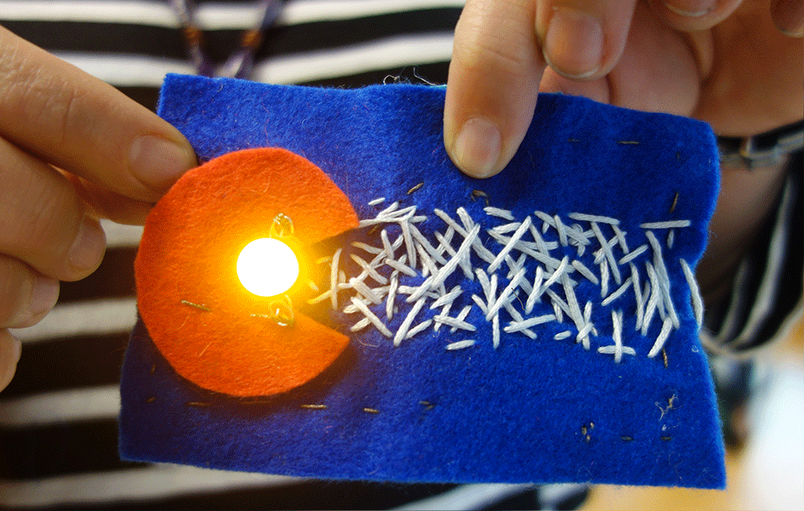

# **E-textile Switches**
## **Thoughts about context and framing**
Some text here

## **The process**
You'll need:
-
-
-
-

*Start by ....*

## **Where this has been carried out in the world and variations based on contexts**

2018 - Zurich, teachers conference
2017 - Mumbai, teachers conference
2015 - Mumbai, Middle schoolers
2014 - introduction to extextiles @ Lighthouse, Oakland, Middle schoolers
